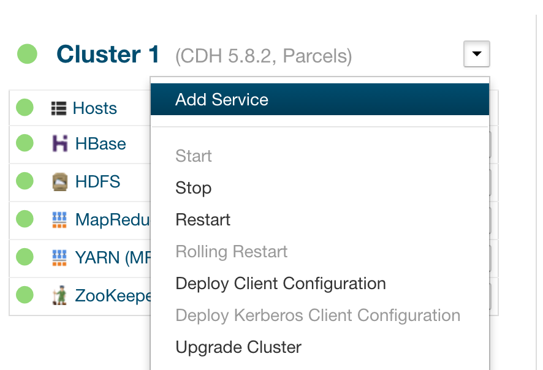
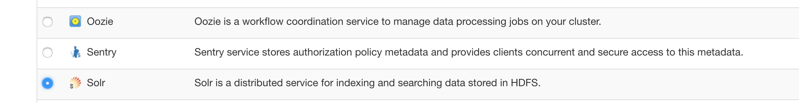
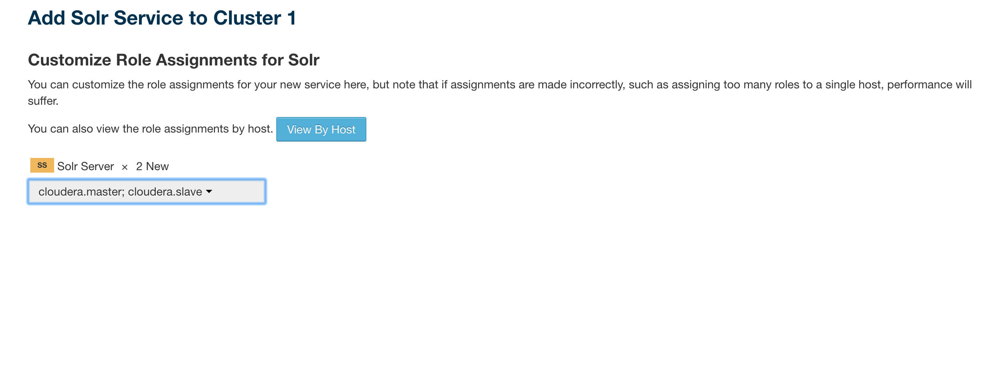
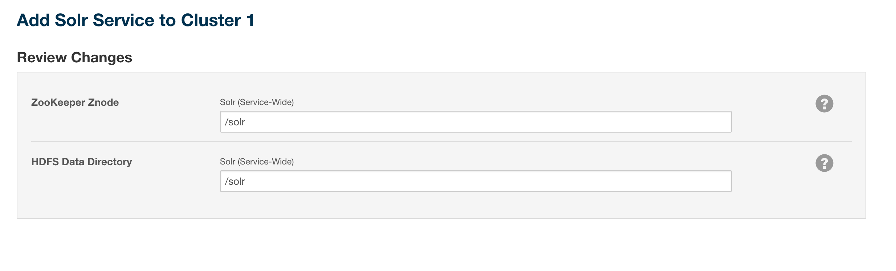
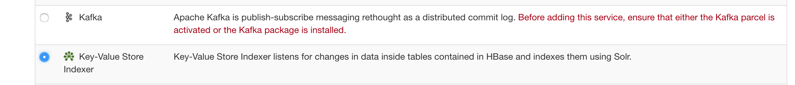
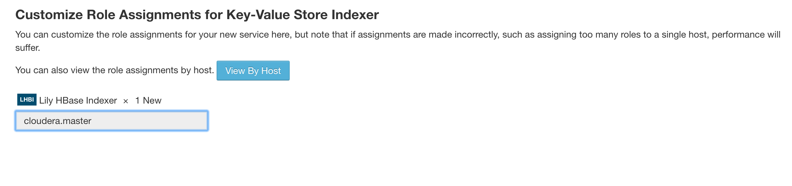
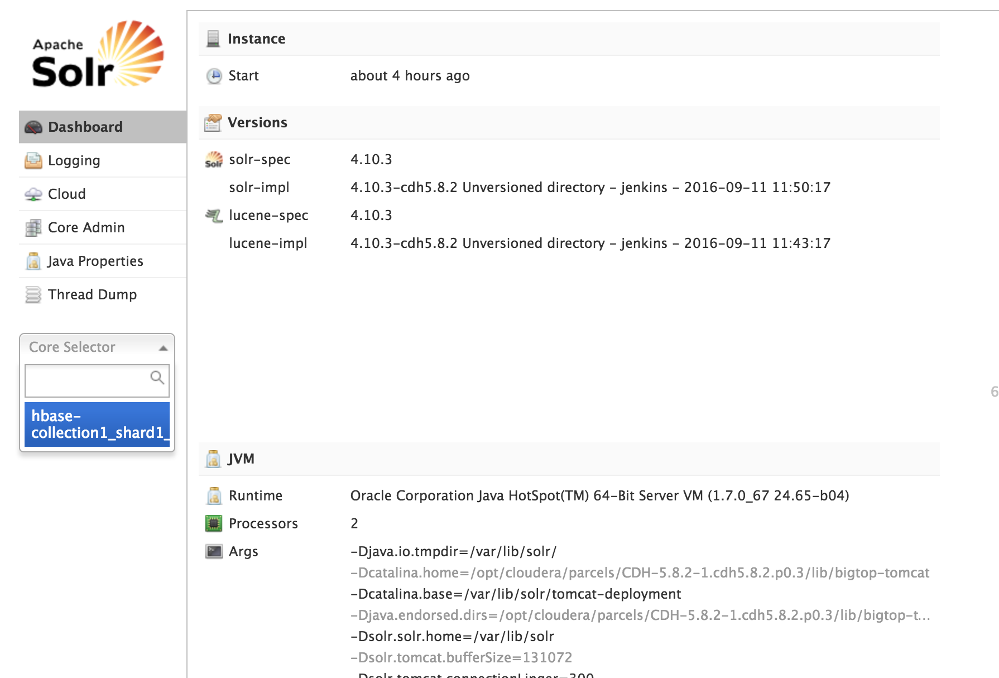
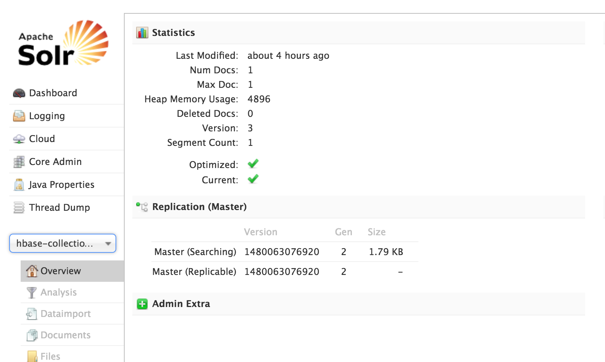
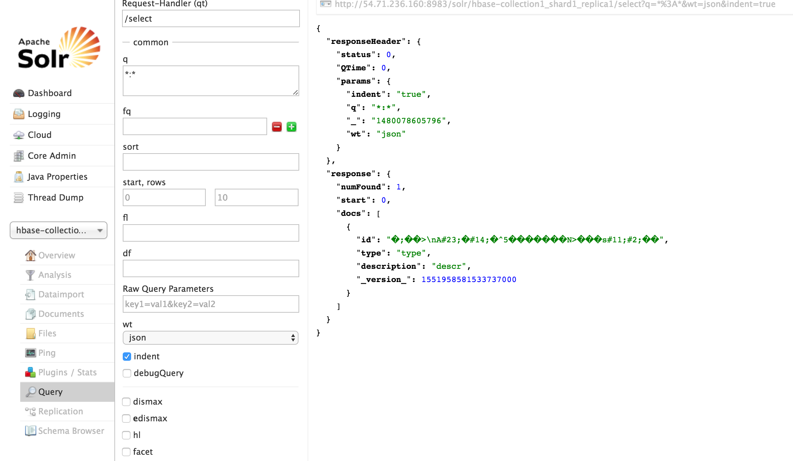

##Environment setup##
  * AWS Cloudera cluster from previous practice
  * Java at least **1.7 version** is required on development machine
  * **Maven is required** on development machine

##Main practice tasks##

  The main goal for this practice is to get more familiar with Hbase concepts. We'll start with real-world problem field and describe it with Hbase schema. Then we'll create Hbase tables and fill them with data using ORM framework Kundera. Add indexes to Hbase records using Lily-Hbase-Indexer and Solr services. After we'll have the data in Hbase, we'll write map reduce job that will count data by specific field. To sum up:

  * Describe problem field
  * Create Hbase schema with Kundera ORM.
  * Fill Hbase storage with data
  * Set up indexing using Lily and Solr
  * Write MapReduce job to analyze data

## Problem field ##

  * Medical Field

    At the top level we have a **Physician** that works for some clinic and accepts patients. Physician also has speciality and common data like name, surname and age. **Patient** that is accepted by Physician, has common demographics data like name, surname and date of birth. All the Patient's medical history is stored within medical records. **Medical Record** is a an atomic event in Patient's life that related to medical sphere, such as diagnosis, examination, visit to doctor, pills prescription. So medical record has type(exam, diagnosis, visit, prescription), date when the action was performed and description of action of medical record.

##Creating Java application that will contain your actual practice##

  So to start with Kundera at first we need to create Java project using Maven(as it's most comfortable way to arrange project in Java world). So using IDE(like IDEA, Eclipse or Netbeans) or manually, create project with proper folder structure and **pom.xml** configuration file where you'll store your classes that will describe your Hbase entities. Below I provided description for entities that should be implemented with Kundera. Additionally I put some pitfalls that you should consider when using Kundera. If you'll have some other difficulties or problems, you can pm me in Slack.

##Implementing Hbase Schema with Kundera ORM##

  To describe problem field entities with [ORM](https://en.wikipedia.org/wiki/Object-relational_mapping) framework(we will use [Kudera](https://github.com/impetus-opensource/Kundera) for this). Kundera is swiss knife for data access to different storages such as MongoDB, Cassandra, Hbase, etc. Using Kundera documentation on Github, you should implement entities described in problem field. For a hint and tests purposes, I provided Entity names and some metadata that should be present in your code. This is very important as we'll have test suite that will check whether Hbase schema data is properly set in storage. So be careful reading practice task and implementing your entities!

* Physician
  * Table name **physicians**
  * Column **id** UUID as byte[]
  * Column **full_name** Name and Surname as String
  * Column **clinic_name** Name of clinic as String
  * Column **specialization** Name of physicians specialization(therapist, dentist, etc.) as String
* Patient
  * Table name **patients**
  * Column **id** UUID as byte[]
  * Column **first_name** Name as String
  * Column **last_name** Surname as String
  * Column **date_of_birth** patient's date of birth as java.util.Date
* Medical Record
  * Table name **medical_records**
  * Column **id** UUID of patient concatenated with UUID of medical record as byte[]
  * Column **type** Type of record (doctor's visit, exam, prescription, etc.) as String
  * Column **description** Record description as String
  * Column **date_performed** date when record was performed as java.util.Date

* **IMPORTANT!**. Few things that you should consider when implementing entities:
  * When using Kundera, you should add dependency on **latest release** and use **hbase-v2** artifact id
```xml
<dependency>
  <groupId>com.impetus.kundera.client</groupId>
  <artifactId>kundera-hbase-v2</artifactId>
  <version>3.6</version>
</dependency>
```  
  * in **Medical Record** UUID is a concatenation of keys. DO not use **@EmbeddedId** for concatenation. Better to use simple **@Id** with byte array and set it with *ArrayUtils.addAll(patient_key,medical_record_key)*
  * Kundera can connect to default Zookeeper port. To change zookeeper host and port, you should add Hbase-specific configuration file in XML format with content as described below:

```xml
      <?xml version="1.0" encoding="UTF-8"?>
      <clientProperties>
        <datastores>
          <dataStore>
            <name>hbase</name>
            <connection>
                <properties>
                    <property name="hbase.zookeeper.quorum" value="your.zookeeper.host"></property>
                    <property name="hbase.zookeeper.property.clientPort" value="your.zookeeper.port"></property>
                </properties>
            </connection>
         </dataStore>
        </datastores>
      </clientProperties>
```

  Also you need to add this file to your *persistence.xml* file:

```xml
      <property name="kundera.client.property" value="name_of_your_xml_with_properties.xml" />
```

* When adding **@Table** your should put *schema* property and as a value to that property **default@your_persistence_unit** so that tables will be created in default Hbase namespace.

* When adding property *kundera.ddl.auto.prepare* to your persistence.xml, put value **update** instead of **create**, as Kundera will try to delete reserved **default** namespace in Hbase.

* To add additional logging, Kundera requires properly configured log4j library. To add that configuration, create a **log4j.properties** file with next content:
```python
# Root logger option
log4j.rootLogger=INFO, stdout

# Direct log messages to stdout
log4j.appender.stdout=org.apache.log4j.ConsoleAppender
log4j.appender.stdout.Target=System.out
log4j.appender.stdout.layout=org.apache.log4j.PatternLayout
log4j.appender.stdout.layout.ConversionPattern=%d{yyyy-MM-dd HH:mm:ss} %-5p %c{1}:%L - %m%n
```

This should add more informative logs of what exactly Kundera is trying to do(load persistence unit, create tables, etc.)

* To create array of bytes from UUID, you should use *Util* class from dependency provided for practice.
```java
//creating random UUID
UUID patientUUID = UUID.randomUUID();
//transforming it into bytes
byte[] patientId = EntityUtil.toBytes(patientUUID);

```

##Running main program with tests##

After we've prepared schema for Hbase we need to test whether our schema was properly configured and working. To do this, we'll put some data into Hbase using Kundera and test if data was put successfully into Hbase. To start with, we'll create simple entry point of an application and also a test class to check whether everything is working properly. After we'll implement entry point and test class, we'll run the created application on cluster to actually check if everything is working.

###Creating entry point###

You will need to create a Java class that need to have public static void main(String[] args) method. This will be entry point of our application. In the main method you should create all three entities MedicalRecord, Patient and Physician and fill them with data. After that you need to *persist()* them all into storage.

###Adding plugins###

* Now let's add some configuration that will allow us to execute our created application. You need to add two simple plugins to your **pom.xml** configuration file. One is standard compiler plugin that will compile your source using Java 1.7 version. The other on is an assembly plugin. We need it to pack our code in one fat jar with all the libs so that we won't have any problems with Java classpath. The fat jar will have *jar-with-dependencies.jar* suffix which is important as if you'll try to run your entry point class with default jar, it will fail. To add plugins you should add below xml components into `<build><plugins></plugins></build>` section(if there is none, create it in pom.xml).
```xml
          <plugin>
              <artifactId>maven-compiler-plugin</artifactId>
              <configuration>
                  <source>1.7</source>
                  <target>1.7</target>
              </configuration>
          </plugin>
          <plugin>
              <artifactId>maven-assembly-plugin</artifactId>
              <version>2.6</version>
              <configuration>
                  <descriptorRefs>
                      <descriptorRef>jar-with-dependencies</descriptorRef>
                  </descriptorRefs>
              </configuration>
              <executions>
                  <execution>
                      <id>make-assembly</id>
                      <phase>package</phase>
                      <goals>
                          <goal>single</goal>
                      </goals>
                  </execution>
              </executions>
          </plugin>
```

###Running example###

* Now we need to create our fat jar and run it on cluster. To do this we need to execute maven packaging command in project directory and then copy created jar into cluster(**IMPORTANT** put your jar to cloudera.master as by default it's the node where zookeeper service is running).

```python
    cd path_to_project
    mvn clean package
    //go for a fat jar
    cd target
    //now lets move fat jar to cloudera.master
    scp your-jar-with-dependencies.jar aws_user@cloudera.master:~/
```
* Now we need to run the example and collect the output.**IMPORTANT you should not forget to collect the execution output as it will be needed as a part of practice acceptance**

```python
  //logging in on cloudera master
  ssh aws_user@cloudera.master
  //now executing out Java application and redirecting output into file.
  /usr/java/jdk1.7.0_67-cloudera/bin/java -classpath your-jar-with-dependencies.jar your.entry.PointClass >> asdf.log
```

###Creating tests###

After you've successfully put data into storage, now it's time to test whether everything is okay. To start with, you need to build up test project that is located in practice2 folder and called **kundera-test**.
To do this you need to go to project directory

```bash
    cd location/kundera-test
    //and build it
    mvn clean install
```

Now you need to add kundera-test project as a dependency to your project, this will allow my test suite to be visible from your created project.

```xml
    <dependency>
    <groupId>com.lits.kundera</groupId>
    <artifactId>testing</artifactId>
    <version>1.0-SNAPSHOT</version>
    </dependency>
```

Then you should create a test class that will **extend** provided test suite by extending **BaseTest** class. Compiler will warn you that you should implement method *customTest()*.This will be your test task for practice - implement *customTest()* method. So after you put your data into storage, now let's write three queries for each table.

First query should check whether returning list of object is not empty and contain one item when you execute **select p from Physician p** query.

Second query should filter Patient by name, so when you execute **select p from Patient p where p.firstName = some_name** where *some_name* is the value you've put for Patient entity with *setFirstName(String name)*. This means that query should not return an empty result and the size of returned list should be equal to 1.

Third query should filter Medical Record by type, so when you execute **select mr from MedicalRecord mr where mr.type = some_type** where *some_type* is DIFFERENT value you've put for MedicalRecord entity with *setType(String type)*. This means that query should return an empty result and the size of returned list should be equal to 0.

To properly launch test you should make an instance of your test class and then execute *runSuite()* method to launch all tests.

* So at the end, your entry point should have something similar flow:

```java
    public static void main(String[] args) {
      putDataInStorage()
      YourTestClass testClass = new YourTestClass();
      testClass.runSuite();
    }
```

##Hbase Indexing##

We'll index few columns in Medical Record table

To properly set up indexing for Hbase, we'll use external services as Hbase does not support indexes. So Cloudera offers indexing via [Solr](http://lucene.apache.org/solr/) with he help of [Lily](http://ngdata.github.io/hbase-indexer/). So using Hbase Solr and Lily, indexing flow will look like this: Record that comes to Hbase, is replicated for Lily Hbase Indexer, that will transform Hbase Record into SolrDocument object and then will be sent directly to Solr whick will index and store data.

###Installing Lily-Hbase-Indexer & Solr services###
Installation is really simple. Just add both services(Lily and Solr) to your cluster.









###Configuring Solr###
    Solr configuration is rather simple. All you need to do manually - properly set up [schema.xml](https://github.com/marianfaryna/lits/blob/master/practice2/schema.xml) - configuration file that will know what columns from SolrDocument that will Lily send to Solr should be indexed and stored. To tart with, we need to create so-called Solr collection - set of fields for indexing that are gathered in one common configuration. Solr provide scripts to prepare default collection. We'll use them and then change the configuration a bit. Login into your *cloudera.master* node and let's start:

```python
ssh aws_user@cloudera.master

//go to your home folder and execute commands below
cd ~/

scp -i ~/key.pem  path_to_practice2/schema.xml ec2-user@54.71.236.160:~/

//generate default collection files
solrctl instancedir --generate ~/hbase-collection1

//now we need to update schema. Default schema is too cumbersome, so schema.xml the one that will fit for our case. We remove default one and then put our schema into conf folder
cp ~/schema.xml ~/hbase-collection1/conf

//now we create Solr collection by putting all collection files into Solr
solrctl instancedir --create hbase-collection1 ~/hbase-collection1

//and the actual collection creation
solrctl collection --create hbase-collection1
```

###Configuring Lily###

* Adjust Hbase
      We need to update properties fof Hbase table that will have index. As Lily Indexer works with replica of data that comes to Hbase, we should update replication factor for table that will have index via Hbase shell. Login to *cloudera.master*
```bash
      ssh aws_user@cloudera.master
      hbase shell
      hbase shell> disable 'medical_records'
      hbase shell> alter 'medical_records', {NAME => 'medical_records', REPLICATION_SCOPE => 1}
      hbase shell> enable 'medical_records'
```
* Set Zookeeper quorum in Lily configuration.
      To do that, you need to add two properties to hbase-indexer-site.xml configuration file. Login to *cloudera.master*
```bash
      ssh aws_user@cloudera.master
      //open configuration for edit
      sudo vi /etc/hbase-solr/conf/hbase-indexer-site.xml
```
```xml
      //add following configuration properties
      <configuration>
      <property>
        <name>hbase.zookeeper.quorum</name>
        <value>cloudera.master</value>
      </property>
      <property>
        <name>hbaseindexer.zookeeper.connectstring</name>
        <value>cloudera.master:2181</value>
      </property>
    </configuration>
```
      //now restart Lily Indexer service from Cloudera UI

* Add proper configuration files
      We need two configuration files for Lily. One is to define actual Indexer and bind it to Hbase table so Indexer can index data in specific Hbase table. The file is called *~/morphline-hbase-mapper.xml*. The content of this file is simple xml configuration as below
```xml
    <?xml version="1.0"?>
    <indexer table="medical_records" mapper="com.ngdata.hbaseindexer.morphline.MorphlineResultToSolrMapper">
   <!-- The relative or absolute path on the local file system to the morphline configuration file. -->
   <param name="morphlineFile" value="/etc/hbase-solr/conf/morphlines.conf"/>
   </indexer>
```

*  Now we need to fill */etc/hbase-solr/conf/morphlines.conf* with proper values. This configuration file will describe what Hbase columns from row should be mapped to SolrDocument fields. The example of configuration file is located [morphlines.conf](https://github.com/marianfaryna/lits/blob/master/practice2/morphlines.conf). Where we map Medical Record columns as type and description to Solr Document fields with same name and type, so that these two columns from Hbase will be indexed in Solr.

The last thing that should be done, is to launch MapReduce provided job, that will index all existing rows in Hbase. To do that, you need to launch this job with parameters:
```bash
    sudo hadoop --config /etc/hadoop/conf jar /opt/cloudera/parcels/CDH-5.8.2-1.cdh5.8.2.p0.3/lib/hbase-solr/tools/hbase-indexer-mr-job.jar --conf /etc/hbase/conf/hbase-site.xml -D 'mapred.child.java.opts=-Xmx500m' --hbase-indexer-file ~/morphline-hbase-mapper.xml --zk-host cloudera.master/solr --collection hbase-collection1 --go-live
```

###Viewing results###
* You can now login into Solr UI to check whether there are indexed entries. To do that, you can go to Solr [web admin page at cloudera master *http://cloudera.master:8983/solr* and choose your Solr collection.
    
    
    


##MapReduce job##

You need to write a MapReduce job that will loop through your MedicalRecord table and count per each Patient the amount of different Medical Records by type. All the information you need is in Medical Record table. To get Patient info, you need to extract the Patient's key from from a part of Medical Record key and then get the full information of Patient by extracted key. The type is already present in Medical Record as a column. So in the end the result of a MapReduce job should be a file that will have next rows:

**Patient ID - type of medical record (amount)**

As there was no data set prepared for the practice, the amount of records in your table can be ~10 as the most important part of the practice is to *understand how MapReduce works* and implement the solution for the task.
