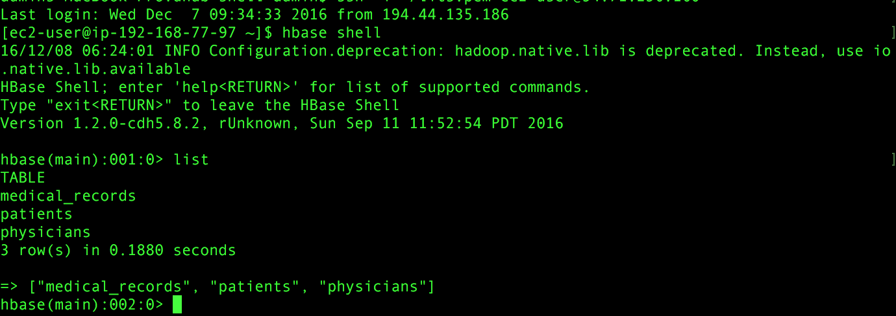
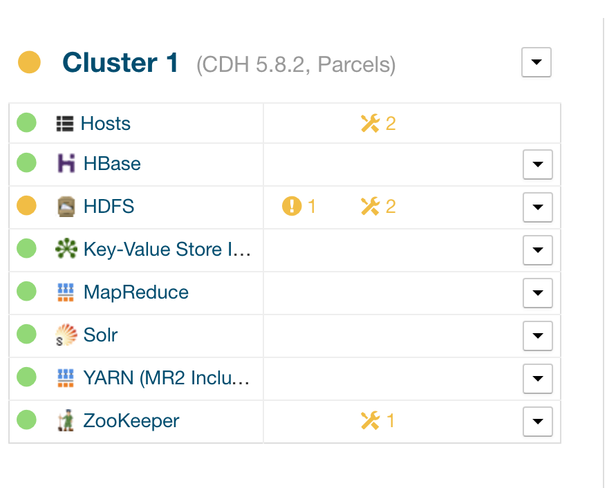
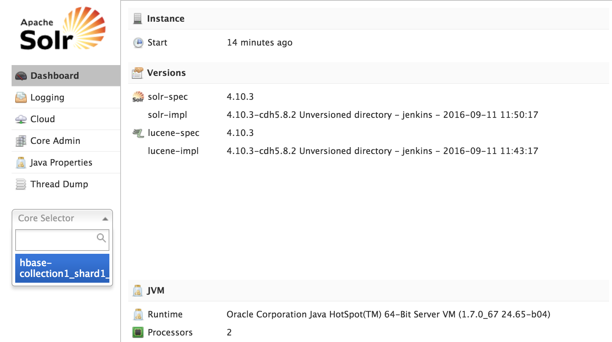
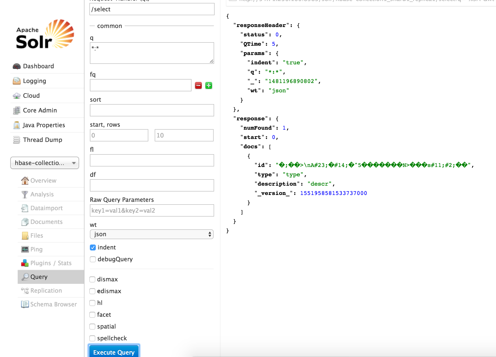

##Practice Acceptance##

  For this practice task will still require taking screenshots and attaching output of your application with test suite. You should fill all the tasks in the [practice acceptance document](https://docs.google.com/spreadsheets/d/1y50_13xftT4ATGkTItBwYbsufgdf2ExtrvDLmYen4Sw/edit?usp=sharing) to successfully pass the practice.

###Attaching logs###

  In second practice task there's a step when you must run your application and redirect the output into a file. There's an example in practice document how to do that. You should attach the link to the log file in practice acceptance document.
    :::code
    /usr/java/jdk1.7.0_67-cloudera/bin/java -classpath your-jar-with-dependencies.jar your.entry.PointClass >> asdf.log

###Hbase shell tables###

  To list tables in Hbase, you should ssh into cloundera.master machine and launch Hbase shell. then execute command to list all tables.
      :::code
      ssh aws-user@cloudera.master
      hbase shell
      hbase(main):001:0> list

###Cloudera Manager Services###

  You need take a screenshot of Cloudera Manager services that include Solr and Lily Hbase Indexer services to show that you've added them and they are live. Atention, please provide external IP of cloudera.master.

  

###Solr Querying###

  The last thing you should do, is to provide a screenshot of Solr query page with some results that you've indexed with Solr.
  To do that, Go to Solr Service Web UI,select the collection and then go to Query tab. Hit the Execute Query button to execute basic query that should return all results from Solr. The result of a query must not be empty.

