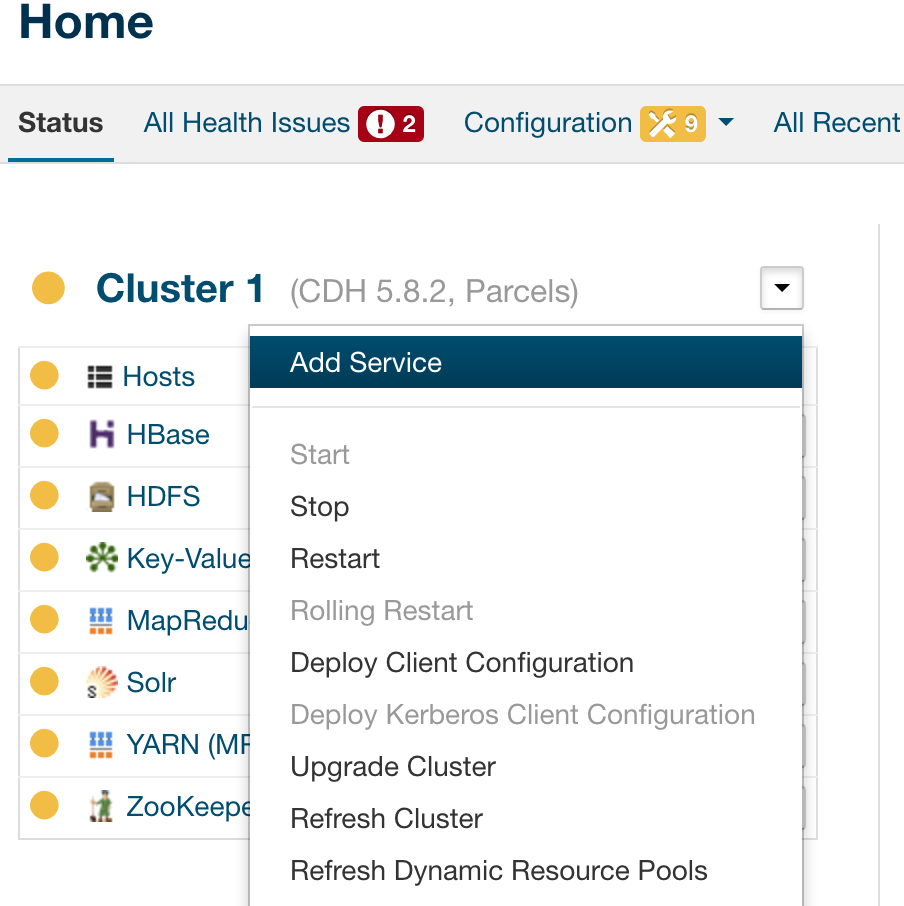
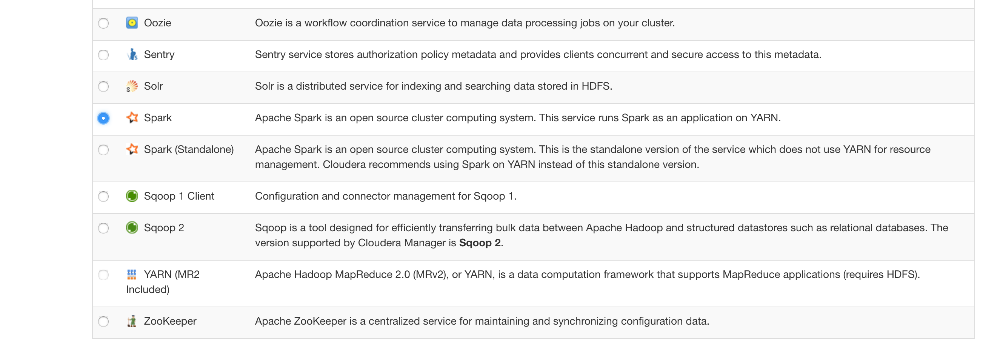
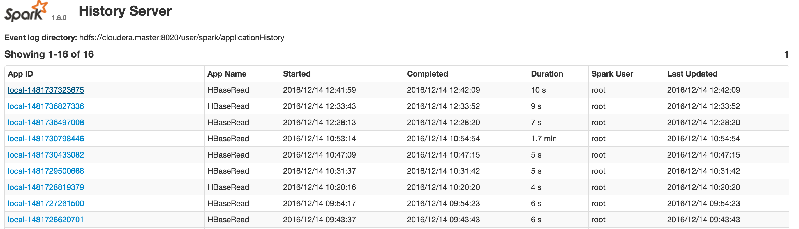
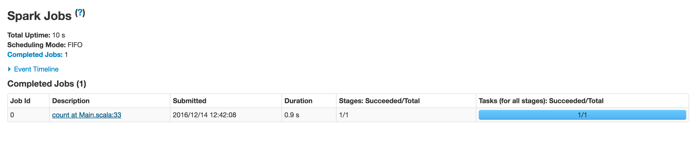
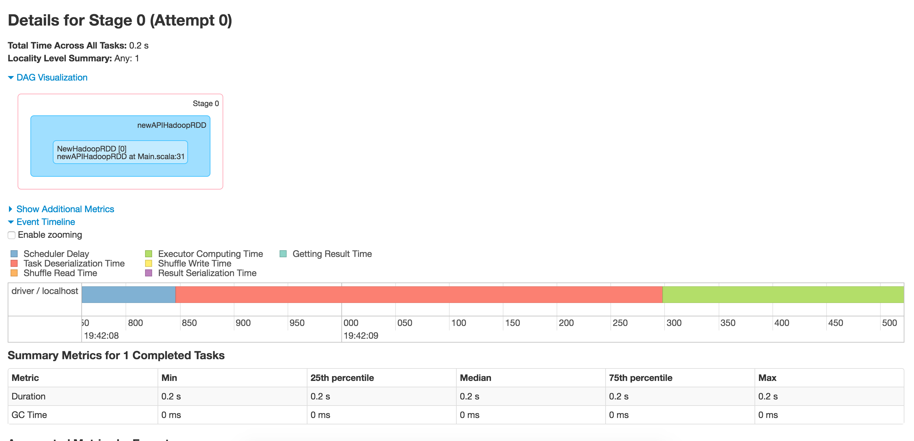

##Practice goal##

This practice will include the introduction to [Apache Spark](http://spark.apache.org/) and we'll try to set up Spark environment on Cloudera cluster and develop a Spark application that will loop through data in Hbase and do similar analytics that we did with MapReduce, only the Spark way. So main steps for this practice will be:

  * Add Spark service to Cloudera Manager

  * Develop Spark application suing Spark API and existing Hbase storage

  * Run the application and check results

##Adding Spark service##

Adding Spark service is as simple as we did for previous services like Lily or Solr. Simply add new service to your cluster.**IMPORTANT** when installing new service you should **NOT choose Spark(Standalone)** but only **Spark** service to install.





##Developing application##

Your main goal for this this application will be basically the one you've done in previous practice. So again you'll **need to count types of medical record by patient**. But using Spark.

So firstly you will need to create a Python script that will initialize SparkContext. After that you will need to create the RDD object that will contain your medical_records table info.

**IMPORTANT Additionally for this task you'll need only to count records which description's length is less then 10 characters long.**

After that, you will need to transform this RDD so it(or new one as RDD are immutable) will have **key as patient id(bytes) + medical record type(bytes)** and value of RDD will be the same **integer value of 1**.

After that you'll need to sum up the values by key and print out the result of your RDD in the manner below:

**Patient ID : {id} has {count} medical records of type {type}**

**NOTE** For this practice I'll provide Scala application that will do almost same thing that should do your Python script. You can also look into [official docs](https://spark.apache.org/docs/0.9.1/python-programming-guide.html), but that's wasn't so helpful IMHO.

##Running application##

Running Spark application is little different from what you've done before launching MapReduce applications. First, you need to upload your fat jar application to your *master* instance. After that launch Spark submit command so that your SPark process will start. After that you should check the result of execution on History Server.

```python
scp your-spark-app aws-user@cloudera.master:~/
//then we'll lauch our application with main class with spark-submit command
spark-submit --class com.lits.spark.Main --master yarn --deploy-mode client /home/ec2-user/spark-test-1.0-SNAPSHOT-jar-with-dependencies.jar >> /home/ec2-user/app.log

```

**NOTE** In the example below I used Java API, so I was launching Spark job the Java way.

**IMPORTANT AGAIN** I've redirected the output again to file. This is very important as the **log file should be attached to practice acceptance document**. So that I could the execution process.

**IMPORTANT!** This is Java execution. To lauch your Python script, please look at [this manual](https://spark.apache.org/docs/0.9.1/quick-start.html#a-standalone-app-in-python)

After application have finished the execution, you should check the **history server** where all the Spark tasks took place and each task have done it's job. To do that you should to to History Server UI that should be located at *http://cloudera.master:18088/* and the latest job should be the one that you've recently launched.






